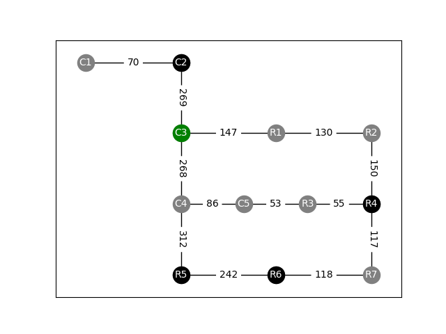

# ConnectiCity Traffic Model

Install in virtual environment via:

```
python -m venv venv              # create venv
. venv/bin/activate   	         # activate venv
pip install -r requirements.txt  # install dependencies
```

Run via command line to return a list with densities for all 13 streets:

```
$ python main.py --areas 0,1,2,0,0,0,0,0,1,1,1,0 --flooding 0
[70, 269, 147, 268, 86, 312, 53, 130, 150, 55, 117, 242, 118]
```

When running commands with `--plot` you will see the resulting graph:

```
$ python main.py --areas 0,1,2,0,0,0,0,0,1,1,1,0 --flooding 0 --plot
```


Documentation via:

```
$ python main.py --help
Usage: main.py [OPTIONS]

Options:
  --areas TEXT                    12 area states in the form 0,0,2,1,... where
                                  0: unpopulated, 1: populated, 2: public
                                  transport. Order is top left to bottom
                                  right.  [required]
  --flooding INTEGER              0: no flooding, 1: flooding, 2:
                                  flooding+communication  [required]
  --plot                          If true, shows the resulting matplotlib
                                  plot.
  --flow_per_commercial_area INTEGER
                                  Flow added to the system by each populated
                                  commercial area
  --flow_per_residential_area INTEGER
                                  Flow added to the system by each populated
                                  residential area
  --public_transport_factor FLOAT
                                  The flow added by areas with public
                                  transport is multiplied by this factor.
  --weight_commercial_unpopulated INTEGER
                                  Target weight for unpopulated commercial
                                  areas
  --weight_commercial_populated INTEGER
                                  Target weight for populated commercial areas
  --weight_residential_unpopulated INTEGER
                                  Target weight for unpopulated residential
                                  areas
  --weight_residential_populated INTEGER
                                  Target weight for populated residential
                                  areas
  --flooded_street_density FLOAT  The density of flooded streets is multiplied
                                  by this factor.
  --flooded_street_avoidance INTEGER
                                  1 is a normal street. The higher this
                                  factor, the more cars try to avoid flooded
                                  roads when communication is enabled.
  --help                          Show this message and exit.
```

